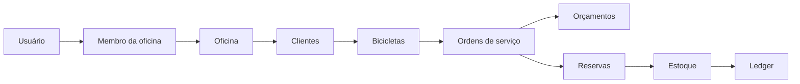

# BikeFlow

Sistema operacional para oficinas de bicicletas. Centraliza clientes, bicicletas, ordens de serviço, orçamentos, equipe e estoque com histórico auditável por oficina.

## Funcionalidades

- Clientes e bicicletas com busca, histórico, arquivamento e transferência de proprietário.
- Ordens de serviço com numeração sequencial por oficina, snapshots históricos, orçamento versionado, execução e retirada.
- Estoque físico e reservado separados, ledger de movimentações, inventário e estorno.
- Cargos e permissões para proprietário, gerente, mecânico e atendimento.
- Isolamento multi-tenant por `workshopId`, optimistic locking e transações críticas `Serializable`.
- Rotas React nativas para dashboard, clientes, bicicletas, OS, estoque, orçamentos e mecânicos; o módulo legado permanece disponível durante a migração funcional.

## Stack e arquitetura

Next.js App Router, React, TypeScript strict, Prisma, PostgreSQL, Better Auth, Zod e Vitest. As rotas HTTP resolvem usuário, oficina e cargo no servidor; services concentram regras de negócio e o Prisma mantém constraints e transações.



## Fluxo de uma OS

Criação e snapshot do cliente/bicicleta → diagnóstico e itens → orçamento → aprovação e reserva → execução e consumo → pronta → retirada/conclusão. Cancelamentos, liberações e estornos ficam registrados no histórico.

## Instalação

Requisitos: Node.js, Corepack/pnpm e PostgreSQL.

```bash
corepack pnpm install
copy .env.example .env
corepack pnpm db:start
corepack pnpm db:deploy
corepack pnpm db:generate
corepack pnpm dev
```

A aplicação abre em `http://localhost:3000`; o health check fica em `/health` e `/api/health`.

### Variáveis de ambiente

- `DATABASE_URL`: conexão PostgreSQL.
- `BETTER_AUTH_SECRET`: segredo único com no mínimo 32 caracteres.
- `BETTER_AUTH_URL`: URL pública da aplicação; hosts públicos em produção devem usar HTTPS.
- `POSTGRES_USER`, `POSTGRES_PASSWORD`, `POSTGRES_DB`: valores do Docker Compose.
- `DEMO_AUTH_ORGANIZATION_ID`, `DEMO_WORKSHOP_NAME`, `DEMO_WORKSHOP_SLUG`: configuração inicial da oficina.

Nunca reutilize o segredo de exemplo em produção.

### PostgreSQL nativo no Windows

O projeto também inclui scripts para um cluster local em `127.0.0.1:5433`:

```bash
corepack pnpm db:native:init
corepack pnpm db:native:start
corepack pnpm db:native:create
corepack pnpm db:deploy
```

## Migrations

Crie migrations com `corepack pnpm db:migrate` e aplique ambientes existentes com `corepack pnpm db:deploy`. As migrations são incrementais e não devem ser editadas depois de implantadas.

## Testes e verificações

```bash
corepack pnpm test
corepack pnpm lint
corepack pnpm typecheck
corepack pnpm check:frontend
corepack pnpm build
```

Os testes de integração exigem PostgreSQL disponível e cobrem concorrência, estoque, OS, permissões, multi-tenancy e optimistic locking.

## Screenshots

Adicione capturas das rotas nativas em `docs/screenshots/` conforme a migração visual avançar.
