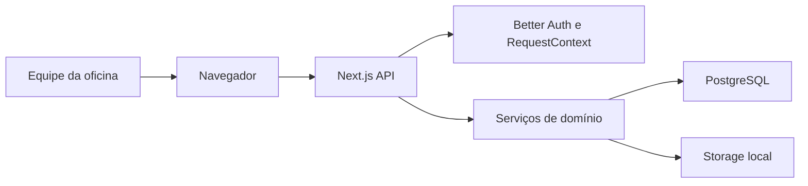

## Executive summary

BikeFlow roda para uma única oficina, em ambiente restrito, e hoje contém somente dados de teste. Assim, o maior risco não é exposição pública ampla, mas alteração indevida de estoque/OS por usuário autenticado, acesso cruzado caso mais oficinas sejam cadastradas e arquivos maliciosos em anexos. Sessão Better Auth, contexto de oficina derivado no servidor, RBAC, Zod, transações serializáveis e validação real do arquivo já reduzem esses riscos.

## Scope and assumptions

- Escopo: `src/app/api`, `src/modules/work-orders`, `src/modules/inventory`, `src/lib`, `public/bikeflow.js` e modelos Prisma relacionados.
- Contexto confirmado pelo proprietário: uso interno/restrito à oficina; dados atuais somente de teste.
- PostgreSQL e armazenamento em `storage/` ficam no mesmo host ou rede confiável.
- Fora do escopo: segurança física do host, sistema operacional, CI externo e futura aprovação pública por link.
- Questão futura: se o sistema for exposto à internet ou usado por múltiplas oficinas reais, TLS, proxy, limites distribuídos e testes de penetração passam a ser requisitos de implantação.

## System model

### Primary components

- Navegador/iframe da aplicação: UI em `public/bikeflow.js`.
- Next.js Route Handlers: autenticação, validação e comandos em `src/app/api`.
- Serviços de domínio: OS/estoque/orçamento em `src/modules`.
- PostgreSQL via Prisma: estado, ledger e auditoria (`prisma/schema.prisma`).
- Armazenamento local: PDFs e anexos oficiais (`src/modules/documents/services/document-service.ts`, `src/modules/work-orders/services/work-order-attachment-service.ts`).

### Data flows and trust boundaries

- Funcionário → Next.js: credenciais, JSON e multipart via HTTP; Better Auth cria sessão, Zod valida JSON e upload valida tamanho e assinatura.
- Next.js → domínio: `RequestContext` deriva usuário/oficina da sessão; permissões são validadas no servidor.
- Domínio → PostgreSQL: Prisma e transações; operações de reserva/baixa usam isolamento serializável.
- Domínio → storage local: nomes gerados por UUID e caminho derivado no servidor; leitura exige sessão e vínculo da OS à oficina.

#### Diagram

## Assets and security objectives

| Asset | Why it matters | Security objective (C/I/A) |
|---|---|---|
| Sessões e credenciais | Controlam acesso administrativo | C/I |
| Estoque, reservas e ledger | Evitam venda dupla e perdas físicas | I/A |
| OS, orçamento e aprovação | Registram autorização e execução | I/A |
| Dados de cliente/bike | PII e histórico técnico | C/I |
| Auditoria e documentos | Evidência operacional imutável | I/A |
| Anexos | Podem conter PII e conteúdo hostil | C/I/A |

## Attacker model

### Capabilities

- Funcionário autenticado tentando exceder seu papel.
- Usuário de outra oficina tentando trocar IDs em requisições.
- Navegador enviando JSON, IDs, quantidades ou arquivos manipulados.
- Repetição e concorrência de comandos críticos.

### Non-capabilities

- Sem acesso presumido ao host, banco, `.env` ou storage.
- Sem exposição pública confirmada e sem dados reais atualmente.
- Sem link público de aprovação implementado no escopo atual.

## Entry points and attack surfaces

| Surface | How reached | Trust boundary | Notes | Evidence (repo path / symbol) |
|---|---|---|---|---|
| API de OS | Requisições autenticadas | Navegador → API | Comandos explícitos e Zod | `src/app/api/work-orders`, `src/modules/work-orders/schemas/work-order.ts` |
| Estoque/reserva | API e transições de OS | API → domínio/DB | Integridade e concorrência críticas | `src/modules/inventory/services/inventory-service.ts`, `src/modules/work-orders/services/work-order-service.ts` |
| Troca de oficina | Sessão ativa | Sessão → contexto | Tenant nunca deve vir do payload | `src/lib/request-context.ts` |
| Upload de anexos | multipart autenticado | Navegador → storage | Tamanho, tipo real e path | `src/modules/work-orders/services/work-order-attachment-service.ts` |
| Download de documento | ID autenticado | API → storage | Consulta restringe oficina | `src/modules/documents/services/document-service.ts` |

## Top abuse paths

1. Usuário troca `workOrderId` por ID de outra oficina → consulta/mutação tenta atravessar tenant → filtros por `workshopId` bloqueiam.
2. Duas aprovações reservam a última peça → concorrência tenta exceder físico → transação serializável e reconciliação impedem saldo inválido.
3. Duplo clique em concluir → tentativa de baixar duas vezes → estado/reserva consumida bloqueia repetição.
4. Usuário sem papel adequado chama endpoint direto → UI não basta → `requirePermission` bloqueia no serviço.
5. Arquivo renomeado como imagem é enviado → assinatura real não corresponde → upload rejeita antes de persistir metadata.
6. Atacante adivinha attachment ID de outra oficina → endpoint cruza relação OS/oficina → retorna não encontrado.

## Threat model table

| Threat ID | Threat source | Prerequisites | Threat action | Impact | Impacted assets | Existing controls (evidence) | Gaps | Recommended mitigations | Detection ideas | Likelihood | Impact severity | Priority |
|---|---|---|---|---|---|---|---|---|---|---|---|---|
| TM-001 | Usuário autenticado | Conta válida e ID alheio | Acesso cruzado entre oficinas | Exposição/alteração de PII e operação | Cliente, OS, estoque | `getRequestContext`; filtros `workshopId` nos serviços | Cobertura deve acompanhar endpoints novos | Manter teste negativo por rota e revisão de query | Auditar 403/404 anormais por usuário | baixa | alta | média |
| TM-002 | Requisições concorrentes | Estoque limitado | Reservar/baixar acima do saldo | Perda e estoque inconsistente | Estoque/ledger | SERIALIZABLE e `reconcileReservations` | PostgreSQL real é requisito | Manter testes simultâneos e constraints | Alertar retries/conflitos e invariantes | média | alta | alta |
| TM-003 | Funcionário com papel menor | Sessão válida | Desconto, cancelamento ou conclusão direta | Fraude/alteração indevida | OS/orçamento | `requirePermission` em serviços | Matriz de permissões precisa revisão periódica | Testes por papel para cada comando | AuditLog de negações e ações sensíveis | média | alta | alta |
| TM-004 | Upload hostil | Acesso a OS ativa | Enviar arquivo inválido ou enorme | DoS/conteúdo ativo | Host/anexos | limite 10 MB, magic bytes, UUID, `nosniff` | Sem antivírus/quota global | Quota por oficina e varredura se houver internet | Métrica por volume/tipo/rejeição | baixa | média | média |
| TM-005 | Usuário/retry | Endpoint crítico | Repetir aprovação/baixa/entrega | Efeito duplicado | Estoque/OS | validação de estado, reservas e transações | Nem todo comando possui chave idempotente externa | Adicionar idempotency key se integrações externas surgirem | Eventos duplicados por janela curta | média | alta | alta |
| TM-006 | Operador do host | Acesso ao filesystem | Ler PDFs/anexos diretamente | Vazamento de PII | Documentos/anexos | API exige tenant; arquivos fora do banco | Storage local depende da segurança do host | Permissões restritas, backup cifrado e storage privado | Auditoria de acesso ao host/storage | baixa | alta | média |

## Criticality calibration

- Crítica: bypass pré-autenticação, RCE ou vazamento amplo de oficinas; nenhum identificado neste escopo restrito.
- Alta: estoque corrompido por concorrência, bypass de papel, acesso cross-tenant com dados reais.
- Média: upload causando DoS local, leitura de um documento isolado, repetição operacional detectável.
- Baixa: informação técnica sem PII ou erro ruidoso recuperável sem alteração persistente.

## Focus paths for security review

| Path | Why it matters | Related Threat IDs |
|---|---|---|
| `src/lib/request-context.ts` | Raiz da identidade e oficina ativa | TM-001, TM-003 |
| `src/shared/auth/permissions.ts` | Matriz RBAC de comandos sensíveis | TM-003 |
| `src/modules/work-orders/services/work-order-service.ts` | Status, consumo e idempotência | TM-002, TM-005 |
| `src/modules/work-orders/services/work-order-quote-service.ts` | Aprovação e reserva atômicas | TM-002, TM-003, TM-005 |
| `src/modules/inventory/services/inventory-service.ts` | Ledger e invariantes físicas | TM-002 |
| `src/modules/work-orders/services/work-order-attachment-service.ts` | Parse e armazenamento de arquivos | TM-004, TM-006 |
| `src/app/api/work-orders` | Superfície HTTP principal | TM-001, TM-003, TM-005 |
| `prisma/schema.prisma` | Constraints, relações e histórico | TM-001, TM-002 |

## Quality check

- Entry points descobertos cobertos: sim.
- Cada fronteira aparece nas ameaças: sim.
- Runtime separado de CI/dev: sim; CI/dev está fora do escopo.
- Contexto do usuário refletido: uso interno e dados de teste.
- Assunção residual explícita: host/storage e banco em ambiente confiável.
